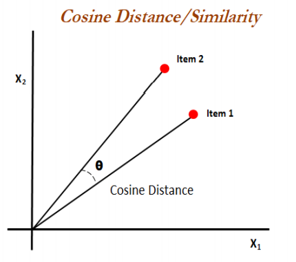

# Quora Question Pairing System

## MERN Stack Machine Learning Application

This is a full-stack web-based machine learning application designed to determine if two input or selected questions share similar meanings or intents.

### Features:

- Predicts if two input questions have the same meaning/intent.
- Stores input questions in a MongoDB database.
- Renders questions stored in the database in the UI.
- Allows users to select any two questions from a list and predict their similarity.

### Technologies Used:

- **Frontend:** React.js, Material UI
- **Backend:** Node.js, Express.js, MongoDB
- **Machine Learning:** Python, Ensemble Learning Algorithms, Data Analysis

### How the Application Works:

1. User submits two input questions, which are stored in the database.
2. The questions are simultaneously passed as parameters to a Python script.
3. The Python script processes the input and predicts the result.
4. The predicted result is rendered in the UI.
5. Questions from the database are fetched using the `get()` method and re-rendered in the UI.
6. If the user selects any two questions from the rendered list, they are processed on the server side, and the result is displayed.

To run the Python script on the server side, I have used Node.js' `child_process()` method.

### Machine Learning Part:

- **Dataset:** Taken from [Kaggle](https://www.kaggle.com/c/quora-question-pairs)
- **Preprocessing:** Cleaning (removing punctuation, stemming, lemmatization, etc.) and preprocessing (cosine similarity, polarity, question length, etc.) using Python's `nltk` library.
- **Feature Engineering:** Generating features out of the cleaned and preprocessed data.
- **Model Training:** Using lightGBM, RandomForest, and XGBoost algorithms. XGBoost model performs the best.
- **Model Evaluation Metric:** Log Loss. Log loss from XGBoost: 0.428

#### How Cosine Similarity Works:

Cosine similarity measures how similar the documents are irrespective of their size. It measures the cosine of the angle between two vectors projected in a multi-dimensional space. Smaller the angle, higher the cosine similarity.

To read more click [here](https://www.machinelearningplus.com/nlp/cosine-similarity/)

#### How Polarity Works:

Polarity analysis takes into account the amount of positive or negative terms that appear in a given sentence. If two questions have different polarity, they have more chances of being different or vice-versa.

To read more click [here](https://www.quora.com/What-is-polarity-and-subjectivity-in-sentiment-analysis).

### Running the Project:

1. Clone this repository to your local machine.
2. Make sure you have `node >= v14.15.3` installed.
3. Install the dependencies by running `npm install`.
4. Run the above command in the backend folder too.
5. Start the server by running `nodemon server` in the backend folder.
6. Start the app by running `npm start` in another terminal.
7. To run the Python script, make sure you have `python >= 3.7` installed.
8. Ensure your server is running before asking the app to predict.
